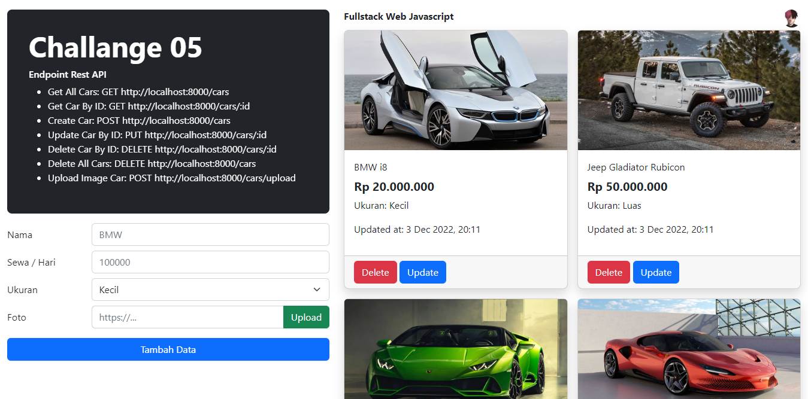
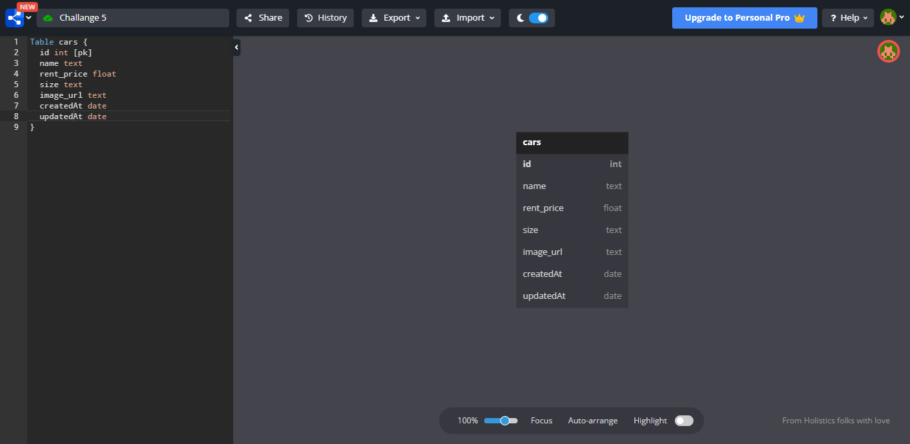
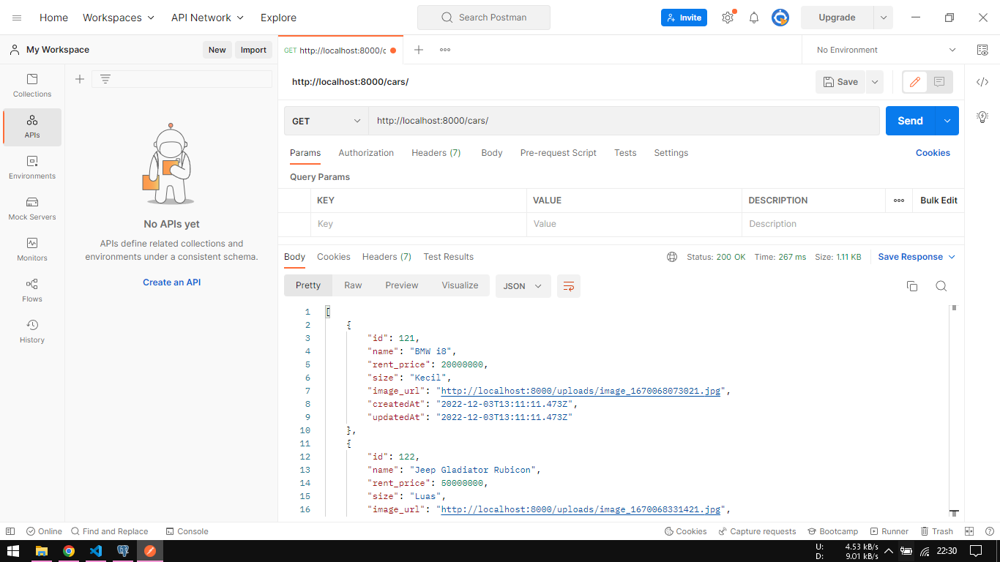

# Preview



# Tutorial Clone

- Buka file `config/config.json` dan ubah pengaturan `development` sesuai dengan pengaturan PostgreSQL Anda.

```javascript
{
  "development": {
    "username": "postgres", // username postgres (default: postgres)
    "password": "nabilaba", // password postgres
    "database": "ch5_development", // nama database
    "host": "localhost", // host postgres (default: localhost)
    "dialect": "postgres" // dialect postgres (default: postgres)
  },
  "test": {
    "username": "postgres", // username postgres (default: postgres)
    "password": "nabilaba", // password postgres
    "database": "ch5_test", // nama database
    "host": "localhost", // host postgres (default: localhost)
    "dialect": "postgres" // dialect postgres (default: postgres)
  },
  "production": {
    "username": "postgres", // username postgres (default: postgres)
    "password": "nabilaba", // password postgres
    "database": "ch5_production", // nama database
    "host": "localhost", // host postgres (default: localhost)
    "dialect": "postgres" // dialect postgres (default: postgres)
  }
}
```

- Jalankan perintah `sequelize db:create` untuk membuat database.
- Konfigrusasi paket yarn dengan perintah `yarn install`.
- Jalankan perintah `yarn start` untuk menjalankan aplikasi.

# Entity Relationship Diagram



# Endpoint Rest API

- Get All Cars: GET http://localhost:8000/cars
- Get Car By ID: GET http://localhost:8000/cars/:id
- Create Car: POST http://localhost:8000/cars
- Update Car By ID: PUT http://localhost:8000/cars/:id
- Delete Car By ID: DELETE http://localhost:8000/cars/:id
- Delete All Cars: DELETE http://localhost:8000/cars
- Upload Image Car: POST http://localhost:8000/cars/upload

# Contoh Request dan Response


